# 编译原理大作业

- 课程名称：编程语言原理与编译
- 实验项目：microc改进
- 专业班级：计算机1801
- 学生学号：31802328
- 学生姓名：滕飞
- 实验指导教师: 郭鸣
- github地址：[编译原理大作业](https://github.com/breath1124/Compiler.git)

## 简介

- 编译原理是计算机专业的一门重要专业课，旨在介绍编译程序构造的一般原理和基本方法。内容包括语言和文法、词法分析、语法分析、语法制导翻译、中间代码生成、存储管理、代码优化和目标代码生成。
- 本次编译原理大作业，我选择了对microc进行改进，丰富完善它的功能，在这门课刚开始时，老师让我们选择一门没有接触过的语言进行学习并写出语言分析报告，当时我选择了Rust语言，Rust是一门系统编程语言，支持函数式和命令式以及泛型等编程范式的多范式语言，是静态的强类型的语言，是一种编译型语言，并且它有许多方便的语法和功能，所以在我改进microc时参考了C语言和Rust语言
- Rust中的核心就是所有权，但在我想去实现它的时候发现异常困难，我对其本质的理解和对编译器的编写能力还有很大的提升空间，自身对技术的掌握也还远远不足，所以最终只是参考了其中的一些语法，并没有将其核心的内容加进去。
- 由于是单人组队，时间不是很充分，有些功能实现的并不理想，运行程序的java虚拟机也是看懂之后自己进行了一些微调然后使用的。


## 结构

- 编译器：`F#语言实现 `
  - `Lex.fsl`生成`Lex.fs`词法分析
  - `Par.fsy`生成`Par.fs`语法分析
  - `AstractSyn.fs`抽象语法树
  - `Machine.fs`指令集定义
  - `Contcomp.fs`编译器
  - `micorcc.fsproj`项目文件

- 虚拟机：`Java实现`

  - `Machine.java`生成`Machine.class`和`Machinetrace.class`

    

- 示例代码：`test文件夹`
- 运行结果：`img文件夹`


## 用法

- `dotnet "C:\Users\Administrator\.nuget\packages\fslexyacc\10.2.0\build\/fslex/netcoreapp3.1\fslex.dll" -o "Lex.fs" --module Lex --unicode Lex.fsl`生成词法分析器·
- `dotnet "C:\Users\Administrator\.nuget\packages\fslexyacc\10.2.0\build\/fsyacc/netcoreapp3.1\fsyacc.dll"  -o "Par.fs" --module Par Par.fsy`生成语法分析器
- `dotnet run -p microcc.fsproj test/xxx.c`编译test文件夹下的C语言程序
- `javac Machine.java`生成虚拟机
- `Java Machine ../test/xxx.out`在虚拟机中运行编译生成的.out文件


## 功能实现

### 自增自减

- 介绍：实现了自增自减操作，包括--i，++i，i++，i--
- 测试用例

```c
int main()
{
    int a = 2;
    a++;
    int b = 5;
    --b;
    int c = 0;
    c++;
    int d = 10;
    d--;
    print a;
    print b;
    print c;
    print d;
}
```

- 运行结果

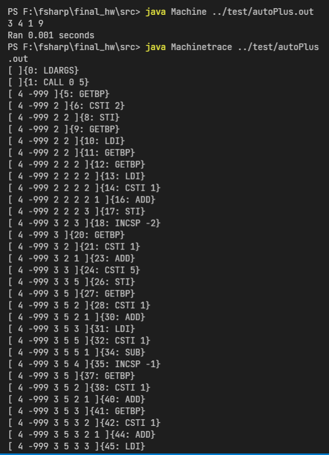


### float类型

- 介绍：实现了浮点数类型，从而使得程序可以进行更精确的计算
- 测试用例

```c
int main()
{
    float a = 1.1;
    int b;
    b = 2;
    print a+b;
}
```

- 运行结果

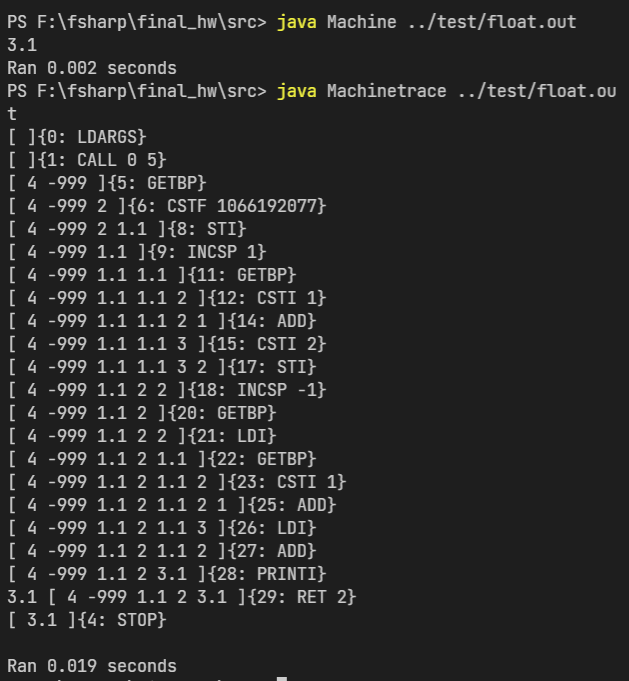


### char类型

- 介绍：实现了字符型，方便对字符进一步操作
- 测试用例

```c
int main()
{
    char a = 't';
    print a;
}
```

- 运行结果

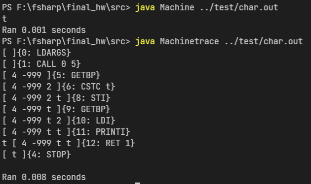


### 变量定义赋值

- 介绍：在microc中变量要先定义再赋值，在这里将其合并为一步，方便简化编码操作
- 测试用例

```c
int main()
{
    int a = 1;
    int b = 2.2;
    int c = 'c';
    print a;
    print b;
    print c;
}
```

- 运行结果

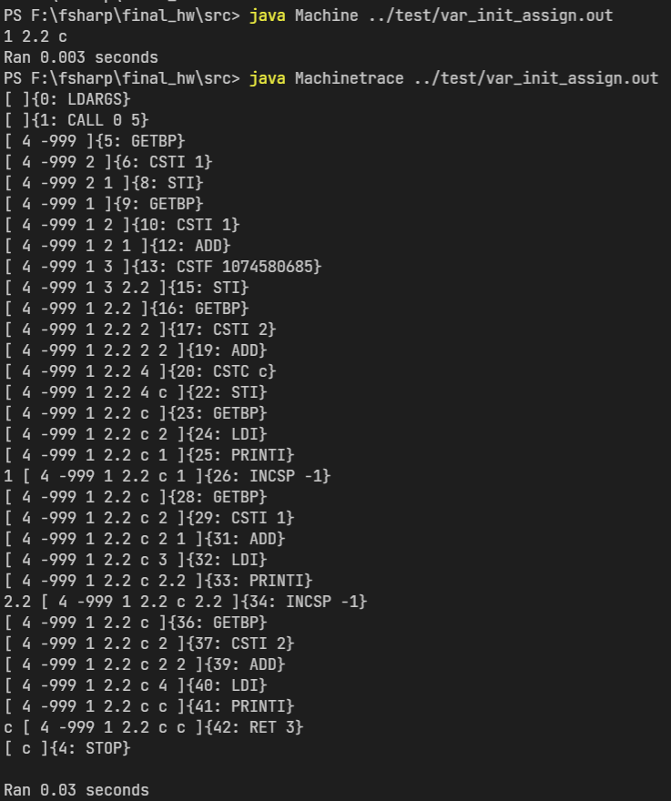


### doWhile循环

- 介绍：microc里已经实现了while循环，这里增加doWhile循环
- 测试用例

```c
int main()
{
    int n = 5;
    do {
        --n;
        print n;
    } while(n > 10);
}
```

- 运行结果

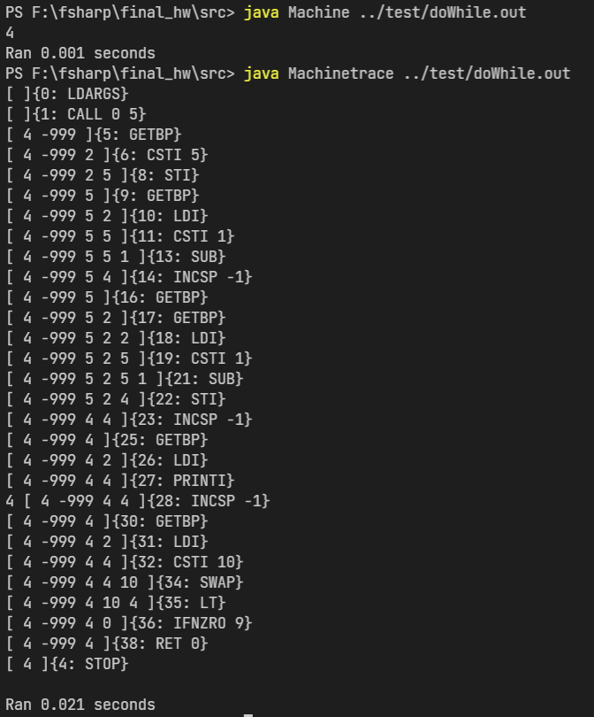


### for循环

- 介绍：实现for循环，众多编程语言中的常见循环方式
- 测试用例

```c
int main()
{
    int i;
    for(i = 0; i < 10; i++) {
        print i;
    }
}
```

- 运行结果

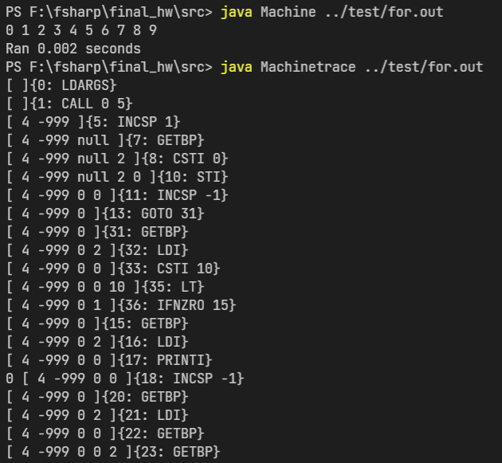


### for  in循环

- 介绍：除了for、while等循环，在rust中还有for in，loop等循环方式，此循环操作是左闭右开区间
- 测试用例

```c
int main()
{
    int i;
    for i in (0..5) {
        print i;
    }
}
```

- 运行结果

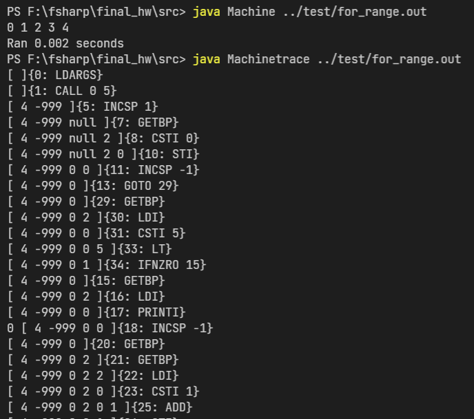


### loop循环

- 介绍：与while(1)循环无限循环类似，在rust语言中直接定义了loop无限循环的方式，在需要是进行break或者return即可，有一定的实用性，所以在microc改进里我也增加了此种循环方式。
- 测试用例

```c
int main()
{
    int i = 1;
    loop {
        print i;
        i++;
        if(i == 11)
            break;
    }
}
```

- 运行结果

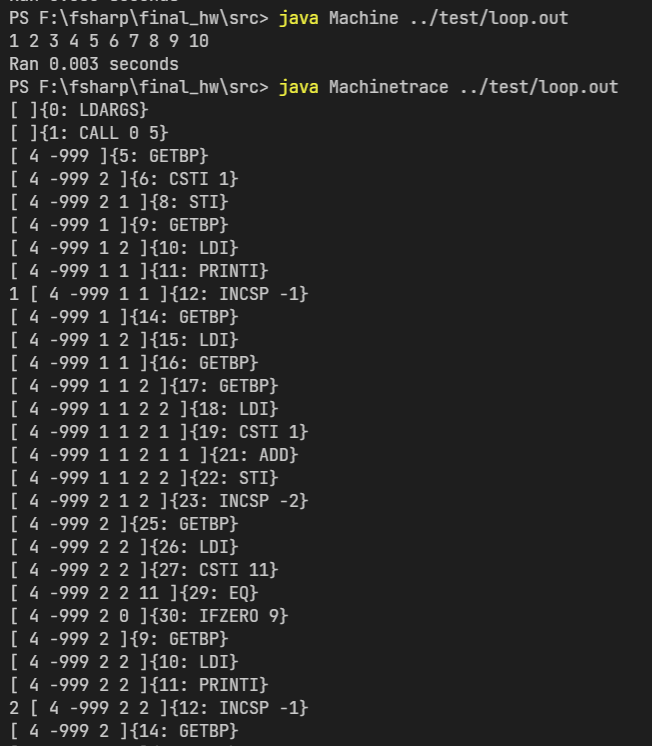


### break功能

- 介绍：当循环满足一定条件需要退出时break就显的十分重要，所以在所有循环中都加入了break功能
- 测试用例

```c
int main()
{
    int i;
    for(i = 0; i < 10; i++) {
        print i;
        if (i > 5)
            break;
    }
}
```

- 运行结果

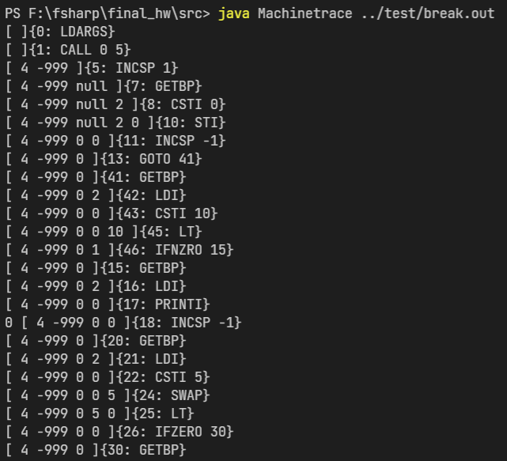


### continue循环

- 介绍：continue和break的重要性相同，当某些条件不需要进入循环但又不想让循环就此结束时break就不合适了，这时候需要用到continue功能
- 测试用例

```c
int main()
{
    int i;
    for(i = 0; i < 10; i++) {
        if(i % 2 == 0)
            continue;
        print i;
    }
}
```

- 运行结果

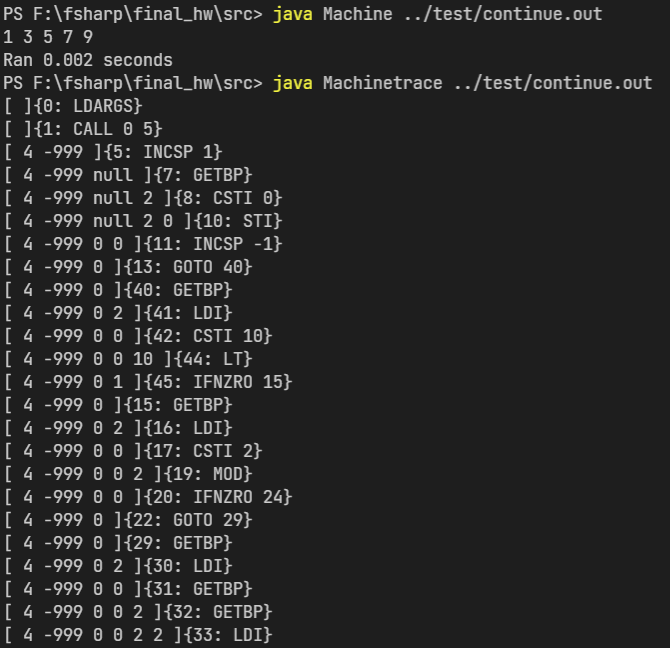


### ? : 表达式

- 介绍：三目运算符，C语言中的基本语法，大概用法如下： `x ? a : b`  如果x成立返回a，否则返回b
- 测试用例

```c
int main()
{
    int a = 1;
    int b = 2;
    int c = a>b ? a:b;
    print c;
}
```

- 运行结果


### switch-case功能

- 介绍：在switch中对相应的case进行匹配，匹配成功后执行之后的所有语句，没有相应匹配时不执行操作
- 测试用例

```c
int main()
{
    int i = 0;
    int n = 2;
    switch(n) {
        case 0: print i+0;
        case 1: print i+1;
        case 2: print i+2;
        case 3: print i+3;
    }
}
```

- 运行结果

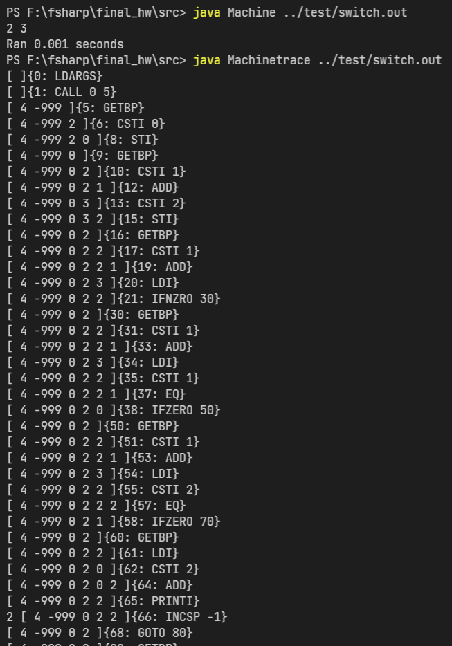


### default功能

- 介绍：在上述switch-case功能中，若没有匹配项则不进行任何操作，这里加入default语句，不论是否匹配成功，default对应的语句一定会被执行
- 测试用例

```c
int main()
{
    int i = 0;
    int n = 5;
    switch(n) {
        case 0: print i+0;
        case 1: print i+1;
        case 2: print i+2;
        case 3: print i+3;
        case 5: print i+5;
        case 6: print i+6;
        default: print n*n;     
    }
}
```

- 运行结果

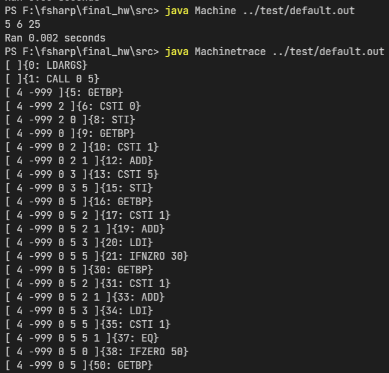


### string类型

- 介绍：相比起char类型，string类型有时候会更加方便，但我在实现的时候遇到了困难，最终只能将字符串的哈希码输出，完成的比较失败
- 测试用例

```c
int main()
{
    string s = "ab";
    print s;
}
```

- 运行结果

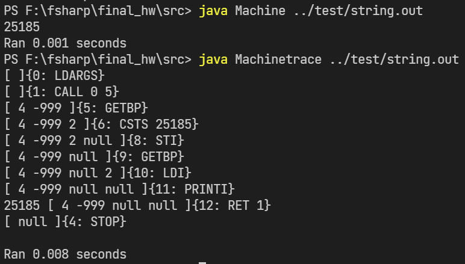


## 成员

| 姓名 | 学号     | 班级       | 任务 | 权重 |
| ---- | -------- | ---------- | ---- | ---- |
| 滕飞 | 31802328 | 计算机1801 | 全部 | 1.0  |


## 提交日志

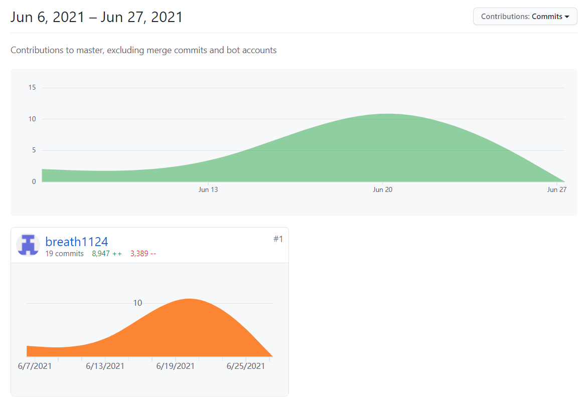


## 技术评价

| 功能           | 测试代码          | 评分（1-5星） |
| -------------- | ----------------- | ------------- |
| 自增自减       | autoPlus.c        | ⭐⭐⭐⭐⭐         |
| float          | float.c           | ⭐⭐⭐⭐⭐         |
| char           | char.c            | ⭐⭐⭐⭐⭐         |
| 变量声明时赋值 | var_init_assign.c | ⭐⭐⭐⭐⭐         |
| doWhile        | doWhile.c         | ⭐⭐⭐⭐⭐         |
| for            | for.c             | ⭐⭐⭐⭐⭐         |
| for in         | for_range.c       | ⭐⭐⭐           |
| loop           | loop.c            | ⭐⭐⭐⭐⭐         |
| break          | break.c           | ⭐⭐⭐⭐⭐         |
| continue       | continue.c        | ⭐⭐⭐⭐⭐         |
| ? :            | ternary.c         | ⭐⭐⭐⭐⭐         |
| switich-case   | switch.c          | ⭐⭐⭐⭐⭐         |
| default        | default.c         | ⭐⭐⭐⭐⭐         |
| string         | string.c          | ⭐             |


## 项目说明

- 项目是基于现有的microc代码进行改进
  - 改进变量声明赋值模块
  - 改进while循环模块
  - 改进doWhile循环模块
  - 改进float、char类型模块
  - 改进for循环模块
  - 改进变量自增自减模块

- 项目独立开发
  - 独立开发了loop循环模块
  - 独立开发了switch-case-default模块
  - 独立开发了break、continue模块
  - 独立开发了？：表达式模块
  - 独立开发了string模块（完成度差）


## 解决技术要点说明

- 解决float小数点问题1，关键代码与步骤如下

  - 先在词法语法分析还有抽象语法树中中定义float，在编译器和虚拟机中添加相应的语法，先将float型变量转为整型存放在指令集中，然后通过栈式虚拟机再将其转换为浮点型，部分代码如下所示

  ```F#
  //lex.fsl
  let keyword s =   
      match s with
      | "float"   -> FLOAT
    	...  
  
  rule Token = parse
    | ['0'-'9']+'.'['0'-'9']+ 
                      { CSTFLOAT (System.Single.Parse (lexemeAsString lexbuf)) }  
    ...
    
  
  //Contcomp.fs
  let rec addCSTF i C = 
      match (i, C) with
      | _                     -> (CSTF (System.BitConverter.SingleToInt32Bits(float32(i)))) :: C
      
  //Machine.java
  case CSTF:
      stack[sp + 1] = new CubyFloatType(Float.intBitsToFloat(program.get(pc++))); sp++; break;
  ```

  

解决default问题2，关键代码与步骤如下

- 先在词法语法分析还有抽象语法树中中定义default，添加相应的语法，刚开始时以为default功能实现完整，测试之后发现如果放在case之前则会报错，经过检查代码之后发现是忽略了写在case前边的语句，将其添加之后错误解决，部分关键代码如下

```F#
//Par.fsy
StmtCase:
    CASE AtExprNotAccess COLON StmtM            { [Case($2, $4)] }
  | CASE AtExprNotAccess COLON StmtM StmtCase   { Case($2, $4) :: $5 }
  | DEFAULT COLON StmtM                         { [Default($3)] }
  | DEFAULT COLON StmtM StmtCase                { Default($3) :: $4 }
;


//Contcomp.fs
let rec cStmt stmt (varEnv : VarEnv) (funEnv : FunEnv) (lablist : LabEnv) (C : instrs list) : instrs list = 
    match stmt with
    ......
    | Switch(e, body) ->
      let (labEnd, C1) = addLabel C
      let lablist = labEnd :: lablist
      let rec allCase case = 
        match case with
		......
        | [Default(last)] ->
          let (label, C2) = addLabel(cStmt last varEnv funEnv lablist C1)
          let (label2, C3) = addLabel(cExpr (BinaryPrim("==", e, e)) varEnv funEnv lablist (IFZERO labEnd :: C2 ))
          (label, label2, C3)
        | Default(last) :: tr ->
          let (labelNextBody, labelNext, C2) = allCase tr
          let (label, C3) = addLabel(cStmt last varEnv funEnv lablist (addGOTO labelNextBody C2))
          let (label2, C4) = addLabel(cExpr (BinaryPrim("==", e, e)) varEnv funEnv lablist (IFZERO labelNext :: C3 ))
          (label, label2, C4)
```


## 心得体会

- 滕飞：

  - 大作业开发过程心得

    ​        在完成大作业的过程中，我对编译原理有了更深的认识，从刚开始学习F#语言到使用F#对microc进行改进，学习到了许多新的东西，对各种编程语言也有了一个大概的了解。由于是单人组队所以在写大作业的时候比较吃力，加上其他课程的大作业要完成，所以最后实现的功能并不是很完美还存在很大的提升空间，与真正成熟完整的编译器完全不能相提并论，但我觉得这门课的意义是让我们学习编译原理的思想，理解其本质，将这种抽象思维可以应用到更加广泛的方面。除此之外我也对编译器的实现有了一定的认识，词法分析、语法分析、抽象语法树、栈式虚拟机等等，每一个步骤都很重要，在整个过程中牵一发而动全身，比较遗憾的是由于时间和能力有所欠缺，一些功能没有实现，今后在学习"道"和"法"的路上还要不断努力。

    - 对编译语言的实现过程有了一定认识
    - 了解了不同的语言类型和优缺点
    - 学习了函数式编程语言
    - 了解了栈式虚拟机和指令集的构建
    - 对语言的创造改进和计算思维有了全新的理解
    - 在编程语言中实现一种新功能要考虑方方面面的问题

  - 本课程建议

    ​       这门课程对计算机专业的同学来说十分重要，对融会贯通计算思维也很有帮助，但感觉课程难度总体偏大，到了课程中后期才逐渐明白实现编程语言的步骤，有时候会觉得理论知识和编程实践联系不是很紧密，比如理论知识自己懂了，但在实验过程中往往不知道从何入手，我觉得可以多讲述一下实验的代码部分，课程难度可以根据同学的反馈程度作出适当调整。

